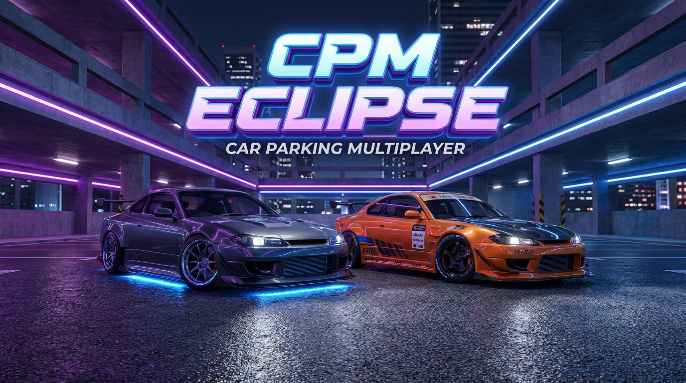

<div align="center">

# 🌙 CPM Eclipse

### Advanced Car Parking Multiplayer Tool

[](https://github.com/YOUR_USERNAME/CPM-Eclipse)
[](LICENSE)
[](https://python.org)
[](https://termux.com)
[](https://github.com/YOUR_USERNAME/CPM-Eclipse)

</div>

---

## 📸 Demo

<div align="center">
  
### 🎬 CPM Eclipse 




</div>

---

## ✨ Features

<div align="center">

### 🎮 Game Features

| Feature | Description | Status |
|---------|-------------|--------|
| 💰 **Money Boost** | Add money instantly | ✅ |
| ⭐ **XP Boost** | Level up faster | ✅ |
| 🚗 **Vehicle Unlock** | Unlock any car | ✅ |
| 🔓 **All Cars** | Unlock every car | ✅ |
| 🏎️ **Speed Hack** | Modify car performance | ✅ |
| 🎨 **Liveries** | Copy liveries | ✅ |
| 🏠 **Houses** | Unlock all houses | ✅ |
| 👑 **Crown** | Get the crown | ✅ |

### 🖥️ UI Features

| Feature | Description | Status |
|---------|-------------|--------|
| 🌈 **RGB Colors** | Animated terminal | ✅ |
| 📊 **Progress Bar** | Visual loading | ✅ |
| 🎬 **Typewriter** | Smooth text | ✅ |
| ✨ **Pulse Effects** | Dynamic feedback | ✅ |
| 📱 **Mobile Optimized** | Termux ready | ✅ |

</div>

---

## 📋 Requirements

<div align="center">

| Requirement | Version |
|-------------|---------|
| **Termux** | F-Droid version |
| **Python** | 3.10 or higher |
| **Internet** | Required for API calls |
| **Storage** | 50MB free space |

</div>

---

## 🚀 Installation

### Method 1: Quick Install (Recommended)

```bash
# Clone the repository
git clone https://github.com/YOUR_USERNAME/CPM-Eclipse.git

# Navigate to folder
cd CPM-Eclipse

# Run install script
chmod +x install.sh
./install.sh

# Run the tool
./eclipse.sh
```

### Method 2: Manual Install

```bash
# Install dependencies
pkg update && pkg upgrade
pkg install python git -y
pip install -r requirements.txt

# Clone and run
git clone https://github.com/YOUR_USERNAME/CPM-Eclipse.git
cd CPM-Eclipse
chmod +x eclipse.sh
./eclipse.sh
```

### Method 3: One-Line Install

```bash
git clone https://github.com/YOUR_USERNAME/CPM-Eclipse.git && cd CPM-Eclipse && chmod +x install.sh && ./install.sh && ./eclipse.sh
```

---

## 📱 Usage

### Launch the Tool

```bash
./eclipse.sh
```

### Main Menu Interface

```
╔══════════════════════════════════════════════════════════╗
║                                                          ║
║    ██████╗ ██████╗ ███╗   ███╗    ███████╗ ██████╗     ║
║   ██╔════╝██╔═══██╗████╗ ████║    ██╔════╝██╔════╝     ║
║   ██║     ██║   ██║██╔████╔██║    █████╗  ██║          ║
║   ██║     ██║   ██║██║╚██╔╝██║    ██╔══╝  ██║          ║
║   ╚██████╗╚██████╔╝██║ ╚═╝ ██║    ███████╗╚██████╗     ║
║    ╚═════╝ ╚═════╝ ╚═╝     ╚═╝    ╚══════╝ ╚═════╝     ║
║                                                          ║
║                 CAR PARKING MULTIPLAYER                  ║
║                    ADVANCED TOOL                         ║
║                                                          ║
║                  Version 1.0.0                           ║
║                  Powered by H3X                         ║
║                                                          ║
╚══════════════════════════════════════════════════════════╝

╔════════════════════════════════════════════╗
║            MAIN MENU                      ║
╠════════════════════════════════════════════╣
║ 1. 💰 Money Boost                       ║
║ 2. ⭐ XP Boost                          ║
║ 3. 🚗 Vehicle Unlock                    ║
║ 4. 🚗 Unlock All Cars                  ║
║ 5. 📊 Check Stats                       ║
║ 6. 🔑 My Info                          ║
║ 7. 🔄 Update Script                    ║
║ 8. ❌ Exit                               ║
╚════════════════════════════════════════════╝
```

---

## 🔧 Troubleshooting

<details>
<summary><b>❌ "config.json not found"</b></summary>

```bash
cp config.example.json config.json
nano config.json
# Add your configuration
```
</details>

<details>
<summary><b>❌ "Permission denied"</b></summary>

```bash
chmod +x *.sh
```
</details>

<details>
<summary><b>❌ "python: command not found"</b></summary>

```bash
pkg install python
```
</details>

<details>
<summary><b>❌ "Module not found"</b></summary>

```bash
pip install -r requirements.txt
```
</details>

---

---

## 📞 Support

<div align="center">

| Contact | Method |
|---------|--------|
| 💬 **Telegram** | [@H3X_cpm](https://t.me/H3X_cpm) |
| 🐛 **Issues** | [GitHub Issues](https://github.com/YOUR_USERNAME/CPM-Eclipse/issues) |

</div>

---

## 👨‍💻 Development

### Building from Source

```bash
# Clone the repository
git clone https://github.com/YOUR_USERNAME/CPM-Eclipse.git
cd CPM-Eclipse

# Install development dependencies
pip install -r requirements-dev.txt

# Run tests
python -m pytest tests/
```

### Contributing

1. Fork the repository
2. Create a feature branch: `git checkout -b feature/amazing-feature`
3. Commit your changes: `git commit -m 'Add amazing feature'`
4. Push: `git push origin feature/amazing-feature`
5. Open a Pull Request

---

## ⚠️ Disclaimer

> **🚨 IMPORTANT NOTICE**
> 
> This tool is for **educational and research purposes only**.
> 
> - ✅ Use at your own risk
> - ❌ We are not responsible for account bans
> - ❌ Do not use for illegal activities
> - ✅ Respect the game's terms of service

---

## 📜 License

This project is licensed under the MIT License - see the [LICENSE](LICENSE) file for details.

---

## 🙏 Credits

<div align="center">

| Role | Name |
|------|------|
| 👨‍💻 **Developer** | H3X |
| 🤝 **Contributors** | Community |
| ⭐ **Special Thanks** | All supporters |

</div>

---

## ⭐ Star Us!

<div align="center">

### If you like this project, give it a ⭐ on GitHub!

[](https://github.com/YOUR_USERNAME/CPM-Eclipse)
[](https://github.com/YOUR_USERNAME/CPM-Eclipse)

---

**Made with ❤️ by H3X**

</div>

---

## 🎯 Quick Links

- [GitHub Repository](https://github.com/YOUR_USERNAME/CPM-Eclipse)
- [Issue Tracker](https://github.com/YOUR_USERNAME/CPM-Eclipse/issues)
- [Changelog](CHANGELOG.md)
- [License](LICENSE)

---

<div align="center">

### 🚀 Happy Hacking!

</div>
